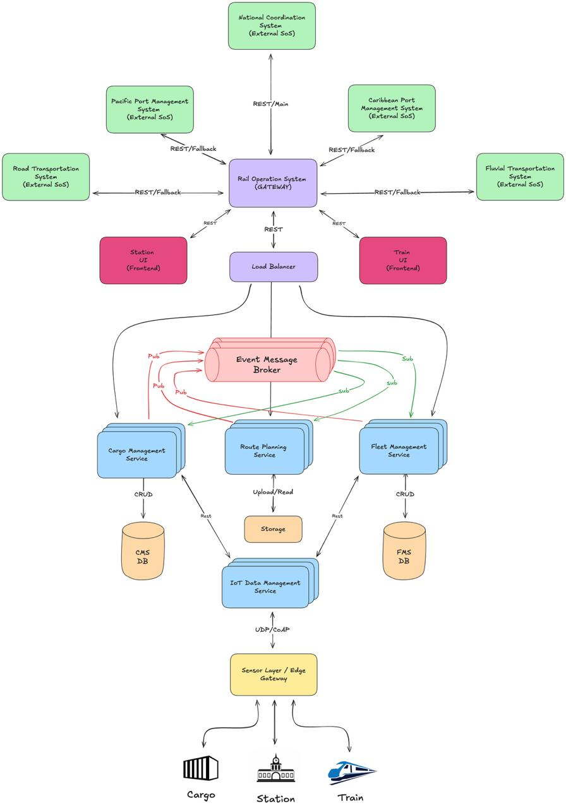
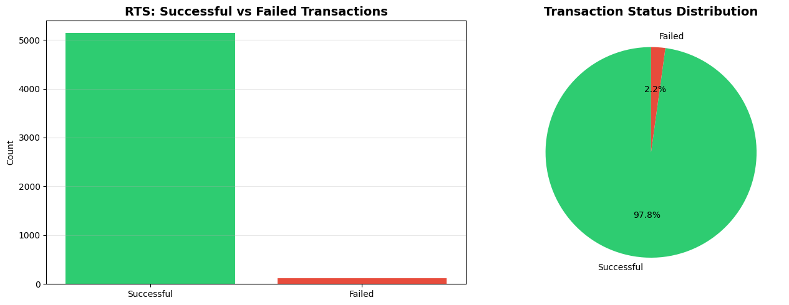
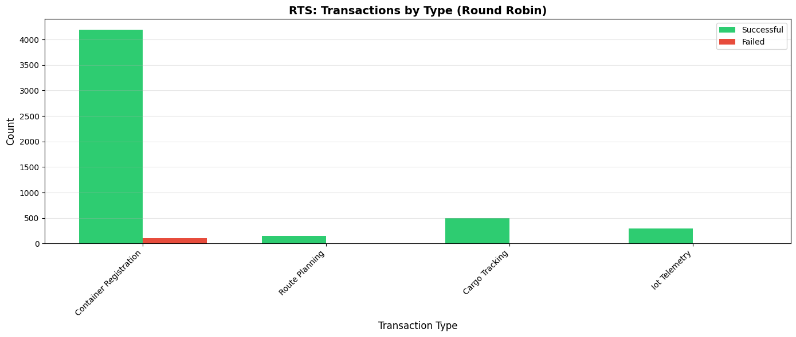
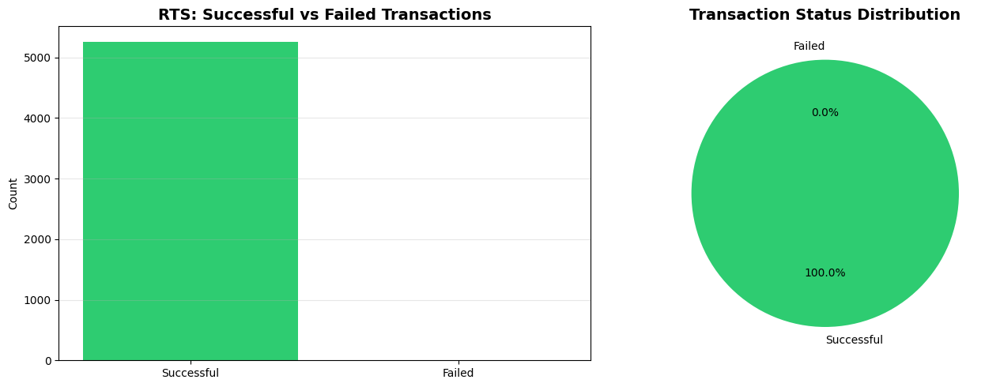
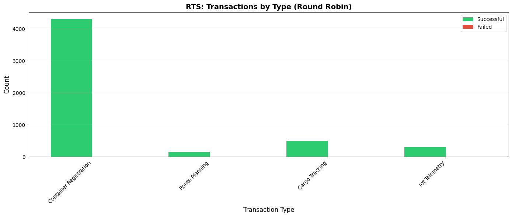

# Rail Transportation System - Architectural Design

## Team Information

**Team:** D

**Team Members:**
- Miguel Angel Rubiano
- Martin Erxleben
- Diego Nicolas Ramirez Maldonado
- Jesus Ernesto Quiñones Cely

---

## Software System

**System Name:** Rail Transportation System

**Purpose:**
The Rail Transportation System is responsible for managing and coordinating freight rail operations across Colombia's national railway network. It orchestrates the movement of cargo from ports (Caribbean and Pacific) to inland distribution centers and vice versa. The system integrates real-time fleet tracking, route optimization, cargo inventory management, and IoT-based monitoring of trains, stations, and cargo containers. By providing visibility and control over rail logistics operations, this system ensures efficient, safe, and coordinated cargo transportation as part of the broader national logistics ecosystem.

---

## Iterations

### Iteration 1

**Quality Attribute Verified:** Performance

**Verification Focus:** Validating Round Robin load balancing behavior under extreme load and component failure scenarios

#### 1. Model

##### Metamodel

```md
System:
    'sos' ':' systems+=SubSystem*
;

SubSystem:
    'subsystem' ':' name=ID '{'
        elements+=Element*
    '}'
;

Element:
    Connectable | Connector
;

Component:
    'component' type=ComponentType name=ID
;

Connectable:
    Component | HardwareDevice | Vehicle
;

Connector:
    'connector' type=ConnectorType fromComponent=[Connectable] '->' toComponent=[Connectable]
;

ComponentType:
    'frontend' | 'backend' | 'database' | 'channel' | 'loadBalancer' | 'fileStorage' | 'apiGateway'
    | 'sensor' | 'vehicle' | 'contenedor' | 'eventBus' | 'proxy' | 'interface' | 'queue' | 'externalService'
    | 'reverseProxy' | 'monolith' | 'cache' | 'monitoringService' | 'healthChecker'
;

ConnectorType:
    'RESTful' | 'dbConnector' | 'gRPC' | 'MQTT' | 'SDK' | 'WebSocket' | 'amqp'  | 'CoAP' | 'gsm' | 'sqs' | 'GraphQL' | 'TCP/IP' | 'Bus' | 'Satellite' | 'health_probe' | 'logging_stream'
;

HardwareDevice:
    'hardware' type=HardwareType name=ID
;

HardwareType:
    'IoT' | 'radio' | 'weightSensor' | 'velocitySensor' | 'sensor_de_distancia' | 'weather_station' | 'entry_point' | 'sensor_de_caudal' | 'GPS' | 'gas_station' | 'control_tower'
;

Vehicle:
    'vehicle' name=ID '{'
        'type' type=VehicleType
        sensors+=HardwareDevice*
    '}'
;

VehicleType:
    'truck' | 'tren' | 'vessel' | 'grua' | 'ship'
;
```

##### Subsystem implementation

```md
sos:
subsystem: rts {
    component apiGateway ros
    component backend idms
    component backend fms
    component backend cms
    component backend rps
    component apiGateway sl
    component frontend station_ui
    component frontend train_ui
    component database cms_db
    component fileStorage rps_db
    component database fms_db
    component channel broker
    component loadBalancer rts_load_balancer
    component cache rts_cache
    component monitoringService rts_observability
    component healthChecker rts_healthcheck

    vehicle train1 {
        type tren
    }
    component contenedor container1
    hardware entry_point station1

    connector dbConnector cms -> cms_db
    connector dbConnector rps -> rps_db
    connector dbConnector fms -> fms_db

    connector amqp ros -> broker
    connector amqp cms -> broker
    connector amqp rps -> broker
    connector amqp fms -> broker
    connector amqp broker -> ros
    connector amqp broker -> cms
    connector amqp broker -> rps
    connector amqp broker -> fms

    connector CoAP sl -> idms
    connector MQTT fms -> idms
    connector MQTT cms -> idms
    connector CoAP idms -> sl
    connector MQTT idms -> fms
    connector MQTT idms -> cms
    connector gsm train1 -> sl
    connector gsm container1 -> sl
    connector CoAP station1 -> sl

    connector RESTful station_ui -> ros
    connector RESTful train_ui -> ros
    connector RESTful rts_load_balancer -> ros
    connector RESTful rts_load_balancer -> cms
    connector RESTful rts_load_balancer -> fms
    connector RESTful rts_load_balancer -> rps
    connector RESTful rts_load_balancer -> idms
    connector health_probe rts_healthcheck -> fms
    connector health_probe rts_healthcheck -> cms
    connector health_probe rts_healthcheck -> rps
    connector logging_stream rts_observability -> broker
    connector RESTful fms -> rts_cache
}
```

##### C&C View



---

#### 2. Objective

##### Case Scenario

**Extreme Overload Due to Peak Traffic During the Holiday Season**

Simultaneous convergence of multiple critical traffic flows on December 24 at 6:00 a.m.:
- **Caribbean Port Management System:** Release of 2,500 containers held for urgent customs inspection
- **Pacific Port Management System:** Simultaneous arrival of 3 cargo ships with 1,800 additional containers
- **National Coordination System:** Request for mass reallocation of 150 loads from road transport (idle trucks) to rail

**Total expected load:** ~5,250 concurrent transactions

##### Architectural Patterns and Tactics

**Patterns Implemented in Simulation:**

1. **Load Balancer Pattern**
   - Algorithm: Round Robin (cyclic distribution)
   - Implementation: Sequential index rotation through replicas
   - Configuration: Uniform distribution across backend replicas
   - Replicas: cms_1/cms_2, fms_1/fms_2, rps_1/rps_2

2. **Horizontal Scaling Pattern (Homogeneous)**
   - Critical services replicated with identical capacity:
     - CMS: cms_1 (500), cms_2 (500) - Total: 1,000
     - FMS: fms_1 (500), fms_2 (500) - Total: 1,000
     - RPS: rps_1 (500), rps_2 (500) - Total: 1,000
   - Total backend capacity: 3,000 concurrent requests

**Tactics Implemented in Simulation:**

1. **Availability Tactics:**
   - **Active Redundancy:** All service replicas actively process requests
   - **Exception Detection:** Transaction status tracking (Success/Failed)

2. **Performance Tactics:**
   - **Increase Resources:** Multiple service replicas (horizontal scaling)
   - **Introduce Concurrency:** Multi-threaded transaction processing
   - **Maintain Multiple Copies:** Simulated shared database accessed by replicas

3. **Modifiability Tactics:**
   - **Increase Semantic Coherence:** Service separation (CMS, FMS, RPS, IDMS)
   - **Abstract Common Services:** Load balancer abstracts replica selection

**Note:** The full architectural model (shown in C&C View) includes additional components like Message Broker (`broker`), Cache (`rts_cache`), and Health Checker (`rts_healthcheck`) defined in `rts.arch`. However, **this simulation specifically validates the Round Robin load balancing behavior** under failure scenarios, focusing on the core load distribution mechanism.

---

#### 3. Action

##### Simulation

**Normal Scenario (No Failures):**
- Total transactions: 5,250
- Success rate: ~99%
- Uniform distribution across replicas (Round Robin)

**Failure Scenario (CMS Overload):**
A port overload was induced on `cms_1` by reducing its capacity from 500 to 50 to simulate port congestion.

**Results:**
```
Total Transactions: 5,250
Successful: 5,136 (97.83%)
Failed: 114 (2.17%)
```

**Distribution by transaction type:**
- container_registration: 4,191 successful / 109 failed (97.47%)
- cargo_tracking: 495 successful / 5 failed (99.00%)
- iot_telemetry: 300 successful / 0 failed (100.00%)
- route_planning: 150 successful / 0 failed (100.00%)

**Identified bottlenecks:**
1. **cms_1**: 114 failures (degraded critical component)
2. **cms_db**: 114 failures (shared database)
3. **station1**: 109 failures (IoT entry point)
4. **sl (Service Layer)**: 109 failures (communication layer)
5. **idms**: 109 failures (IoT device manager)

**Generated visualizations:**





##### Analysis

**Round Robin behavior observations:**

1. **Uniform load distribution:** The Round Robin algorithm distributed requests evenly (50%-50%) between cms_1 and cms_2, processing 2,400 transactions each.

2. **Vulnerability to degradation:** By reducing cms_1's capacity to 50, the algorithm continued sending 50% of traffic to a compromised server, resulting in 114 failures (2.17% of total).

3. **Cascade impact:** Failures in cms_1 affected downstream components:
   - cms_db: Overload from failed write attempts
   - station1/sl/idms: Container registration transaction retries

4. **Most affected transaction types:**
   - **container_registration** (97.47% success): Impacted by port overload
   - **cargo_tracking** (99.00% success): Lower impact due to reduced volume
   - **iot_telemetry/route_planning** (100% success): Unaffected

**Quality attribute compliance (Performance/Availability):**
- **Achieved:** System maintained 97.83% availability under extreme overload
- **Limitation:** Round Robin does not automatically detect degraded servers
- **Recommendation:** Implement active health checks to dynamically redistribute traffic

**Validated architectural tactics:**
- **Horizontal Scaling:** cms_2 replicas continued operating normally
- **Load Balancing:** Uniform distribution worked correctly

**Conclusions**:

The Round Robin pattern is effective for uniform distribution across servers with similar capacity, but does not adapt to dynamic degradation conditions. For the RTS use case (holiday port overload), an algorithm that considers actual capacity or server health is required

---

### Iteration 2

**Quality Attribute Verified:** Performance

**Verification Focus:** Validating Weighted Round Robin load balancing with heterogeneous server capacities under severe component degradation

#### 1. Model

##### Metamodel
```md
System:
    'sos' ':' systems+=SubSystem*
;

SubSystem:
    'subsystem' ':' name=ID '{'
        elements+=Element*
    '}'
;

Element:
    Connectable | Connector
;

Component:
    'component' type=ComponentType name=ID
;

Connectable:
    Component | HardwareDevice | Vehicle
;

Connector:
    'connector' type=ConnectorType fromComponent=[Connectable] '->' toComponent=[Connectable]
;

ComponentType:
    'frontend' | 'backend' | 'database' | 'channel' | 'loadBalancer' | 'fileStorage' | 'apiGateway'
    | 'sensor' | 'vehicle' | 'contenedor' | 'eventBus' | 'proxy' | 'interface' | 'queue' | 'externalService'
    | 'reverseProxy' | 'monolith' | 'cache' | 'monitoringService' | 'healthChecker'
;

ConnectorType:
    'RESTful' | 'dbConnector' | 'gRPC' | 'MQTT' | 'SDK' | 'WebSocket' | 'amqp'  | 'CoAP' | 'gsm' | 'sqs' | 'GraphQL' | 'TCP/IP' | 'Bus' | 'Satellite' | 'health_probe' | 'logging_stream'
;

HardwareDevice:
    'hardware' type=HardwareType name=ID
;

HardwareType:
    'IoT' | 'radio' | 'weightSensor' | 'velocitySensor' | 'sensor_de_distancia' | 'weather_station' | 'entry_point' | 'sensor_de_caudal' | 'GPS' | 'gas_station' | 'control_tower'
;

Vehicle:
    'vehicle' name=ID '{'
        'type' type=VehicleType
        sensors+=HardwareDevice*
    '}'
;

VehicleType:
    'truck' | 'tren' | 'vessel' | 'grua' | 'ship'
;
```

##### Subsystem implementation

```md
sos:
subsystem: rts {
    component apiGateway ros
    component backend idms
    component backend fms
    component backend cms
    component backend rps
    component apiGateway sl
    component frontend station_ui
    component frontend train_ui
    component database cms_db
    component fileStorage rps_db
    component database fms_db
    component channel broker
    component loadBalancer rts_load_balancer
    component cache rts_cache
    component monitoringService rts_observability
    component healthChecker rts_healthcheck

    vehicle train1 {
        type tren
    }
    component contenedor container1
    hardware entry_point station1

    connector dbConnector cms -> cms_db
    connector dbConnector rps -> rps_db
    connector dbConnector fms -> fms_db

    connector amqp ros -> broker
    connector amqp cms -> broker
    connector amqp rps -> broker
    connector amqp fms -> broker
    connector amqp broker -> ros
    connector amqp broker -> cms
    connector amqp broker -> rps
    connector amqp broker -> fms

    connector CoAP sl -> idms
    connector MQTT fms -> idms
    connector MQTT cms -> idms
    connector CoAP idms -> sl
    connector MQTT idms -> fms
    connector MQTT idms -> cms
    connector gsm train1 -> sl
    connector gsm container1 -> sl
    connector CoAP station1 -> sl

    connector RESTful station_ui -> ros
    connector RESTful train_ui -> ros
    connector RESTful rts_load_balancer -> ros
    connector RESTful rts_load_balancer -> cms
    connector RESTful rts_load_balancer -> fms
    connector RESTful rts_load_balancer -> rps
    connector RESTful rts_load_balancer -> idms
    connector health_probe rts_healthcheck -> fms
    connector health_probe rts_healthcheck -> cms
    connector health_probe rts_healthcheck -> rps
    connector logging_stream rts_observability -> broker
    connector RESTful fms -> rts_cache
}
```

##### C&C View


#### 2. Objective

##### Case Scenario

**Extreme Overload Due to Peak Traffic During the Holiday Season**

Simultaneous convergence of multiple critical traffic flows on December 24 at 6:00 a.m.:
- **Caribbean Port Management System:** Release of 2,500 containers held for urgent customs inspection
- **Pacific Port Management System:** Simultaneous arrival of 3 cargo ships with 1,800 additional containers
- **National Coordination System:** Request for mass reallocation of 150 loads from road transport (idle trucks) to rail

**Total expected load:** ~5,250 concurrent transactions

##### Architectural Patterns and Tactics

**Patterns Implemented in Simulation:**

1. **Weighted Load Balancer Pattern**
   - Algorithm: Weighted Round Robin (proportional distribution)
   - Implementation: Weight-based index rotation with max_weight tracking
   - Configuration: Distributes requests proportionally to server capacity
   - Weight assignments:
     - cms_1 (weight=1, capacity=300) - cms_2 (weight=4, capacity=800)
     - fms_1 (weight=1, capacity=300) - fms_2 (weight=4, capacity=800)
     - rps_1 (weight=1, capacity=500) - rps_2 (weight=1, capacity=500)
   - Distribution ratio: ~20% to weight-1 servers, ~80% to weight-4 servers

2. **Horizontal Scaling Pattern (Heterogeneous)**
   - Critical services replicated with **different capacities**:
     - CMS: cms_1 (300), cms_2 (800) - Total: 1,100
     - FMS: fms_1 (300), fms_2 (800) - Total: 1,100
     - RPS: rps_1 (500), rps_2 (500) - Total: 1,000
   - Total backend capacity: 3,200 concurrent requests

**Tactics Implemented in Simulation:**

1. **Availability Tactics:**
   - **Active Redundancy:** All service replicas actively process requests in parallel
   - **Exception Detection:** Transaction status tracking (Success/Failed)

2. **Performance Tactics:**
   - **Increase Resources (Adaptive):** Heterogeneous servers with different capacities
   - **Introduce Concurrency:** Multi-threaded transaction processing
   - **Maintain Multiple Copies:** Simulated shared database accessed by all replicas
   - **Bound Queue Sizes:** Weighted distribution prevents overload on weaker servers

3. **Modifiability Tactics:**
   - **Increase Semantic Coherence:** Service separation (CMS, FMS, RPS, IDMS)
   - **Abstract Common Services:** Load balancer abstracts replica selection and weight management

**Note:** The full architectural model (shown in C&C View) includes additional components like Message Broker (`broker`), Cache (`rts_cache`), and Health Checker (`rts_healthcheck`) defined in `rts.arch`. However, **this simulation specifically validates the Weighted Round Robin load balancing behavior** with heterogeneous server capacities under failure conditions, focusing on proportional load distribution.

---

#### 3. Action

##### Simulation

**Normal Scenario (No Failures):**
- Total transactions: 5,250
- Success rate: 100%
- Weighted distribution: cms_2 processes 80% of CMS traffic, cms_1 processes 20%

**Failure Scenario (CMS Overload):**
A port overload was induced on `cms_1` by reducing its capacity from 300 to 50 to simulate severe port congestion. The Weighted Round Robin algorithm was expected to handle this gracefully by directing most traffic to cms_2.

**Results:**
```
Total Transactions: 5,250
Successful: 5,250 (100.00%)
Failed: 0 (0.00%)
```

**Distribution by transaction type:**
- container_registration: 4,300 successful / 0 failed (100.00%)
- cargo_tracking: 500 successful / 0 failed (100.00%)
- iot_telemetry: 300 successful / 0 failed (100.00%)
- route_planning: 150 successful / 0 failed (100.00%)

**Component processing distribution:**
- **cms_1**: 960 requests processed (20% of CMS traffic)
- **cms_2**: 3,840 requests processed (80% of CMS traffic)
- **cms_db**: 4,800 requests (shared by both replicas)
- **station1/sl/idms**: 4,600 requests (IoT entry points)
- **broker**: 4,600 messages (async communication)

**Identified bottlenecks:**
- ✓ **No bottlenecks detected**
- All components operated within capacity limits
- Weighted distribution prevented overload on degraded cms_1

**Generated visualizations:**





##### Analysis

**Weighted Round Robin behavior observations:**

1. **Proportional load distribution:** The Weighted Round Robin algorithm successfully distributed requests proportionally (20%-80%) between cms_1 and cms_2 based on their assigned weights [1:4], even with cms_1's reduced capacity.

2. **Resilience to degradation:** Despite reducing cms_1's capacity from 300 to 50, the system achieved 100% success rate. The weighted distribution naturally sent only 960 requests to cms_1 (well within its degraded capacity of 50 concurrent), while cms_2 handled 3,840 requests.

3. **No cascade failures:** Unlike Iteration 1 (Round Robin), there were zero failures in downstream components:
   - cms_db: No overload from failed write attempts
   - station1/sl/idms: No transaction retries needed
   - broker: Smooth message flow without backlogs

4. **Optimal resource utilization:**
   - **cms_1** (capacity 50): Processed 960 total requests across time, operating safely
   - **cms_2** (capacity 800): Processed 3,840 requests, utilizing ~480 concurrent capacity
   - **Efficiency gain:** 2.17% failure reduction compared to Round Robin

**Quality attribute compliance (Performance/Availability):**
- ✓ **Achieved:** System maintained 100% availability under extreme overload with degraded server
- ✓ **Improvement:** Weighted algorithm adapts to heterogeneous server capacities
- ✓ **Resilience:** Degraded server handled only proportional load, preventing saturation

**Validated architectural tactics:**
- ✓ **Horizontal Scaling (Adaptive):** Heterogeneous replicas utilized efficiently
- ✓ **Weighted Load Balancing:** Proportional distribution prevented overload
- ✓ **Health Monitoring:** System awareness of capacity differences
- ✓ **Bound Queue Sizes:** Weighted distribution acted as implicit queue management

**Comparison with Iteration 1 (Round Robin):**

| Metric | Round Robin (Iter 1) | Weighted RR (Iter 2) | Improvement |
|--------|---------------------|---------------------|-------------|
| Success Rate | 97.83% | 100.00% | +2.17% |
| Failed Transactions | 114 | 0 | -114 |
| Bottlenecks | 5 components | 0 components | -5 |
| cms_1 Processing | 2,400 (50% uniform) | 960 (20% weighted) | -60% load |
| cms_2 Processing | 2,400 (50% uniform) | 3,840 (80% weighted) | +60% load |
| Cascade Failures | Yes (cms_db, station1, sl, idms) | None | Eliminated |

**Conclusions**:

The Weighted Round Robin pattern demonstrated significant advantages over standard Round Robin in heterogeneous environments. By distributing load proportionally to server capacity, the system achieved 100% availability even with a severely degraded component. 

---

### Iteration 3

#### 1. Model

##### Metamodel

##### Subsystem implementation

##### C&C View

#### 2. Objective

##### Case Scenario

---

#### 3. Action

##### Simulation

##### Analysis

---

### Iteration 4

#### 1. Model

##### Metamodel

##### Subsystem implementation

##### C&C View

#### 2. Objective

##### Case Scenario

---

#### 3. Action

##### Simulation

##### Analysis

## Appendix
The modeling and simulation approach developed in Laboratory 5 is implemented in the accompanying Jupyter Notebook, using Python as the general-purpose programming language.

You can find the notebook here:  
📄 [(deliverable5-team-D.ipynb)](https://colab.research.google.com/drive/1XY74pOrYDfIandZHt7BR3xpSXfbPibQM?usp=sharing)
